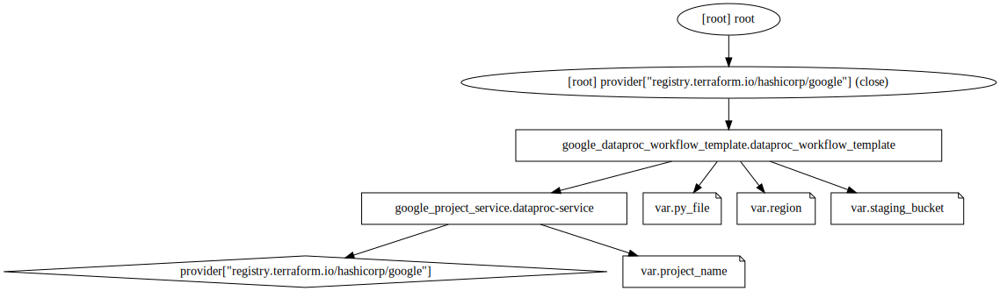
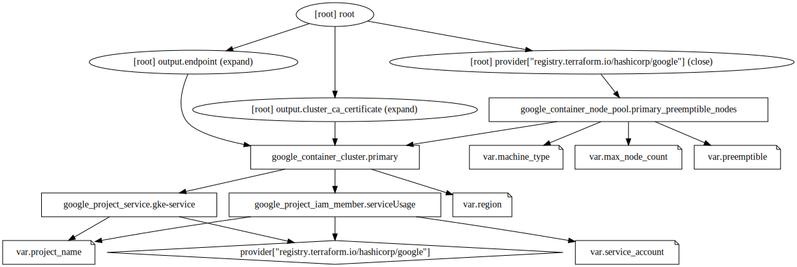
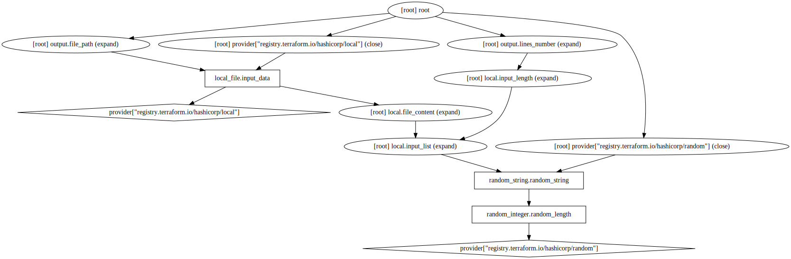
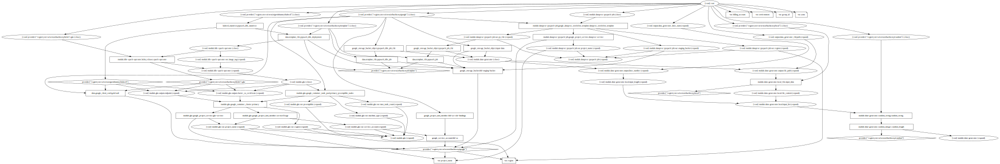

# TBD Project

The main idea of the project was how to work with GCP, terraform, Kubernetes, Docker and knowing that  machine learning pipeline had to be created.

Project was divided on a few steps:
- 1a creating the proper work environment on GCP (accounts, access, budgets, autoscaling and other things), all  was done with terminal and terraform, 
- 1b using automated github (terraform + GCP), 
- 2a learn sparkSQL also  how the spark works (difference between distrubuted systems and normal systems),
- 2b create pipeline of learning on your local machine (conterezided), 
- 3a use the same Code on GCP.
    
All of the above are can be found in this repo.

This repo contains of a few modules:
- data - generator (used for 1a generates string data and saves it to csv),
- dataproc-pyspark-job - creates a cluster with master and worker nodes and executes pyspark job,
- gke - kubernetes cluster on gke,
- outside k8s-spark-operator - this one lets kubernetes clusters execute our pyspark job which is located src/py/pyskarp_job_py.tpl in this repo. 

Structure of modules:

